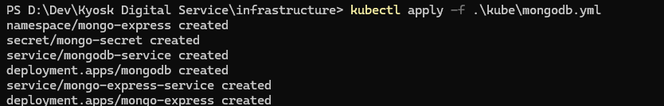
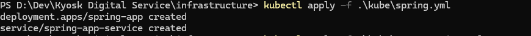
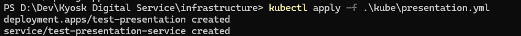
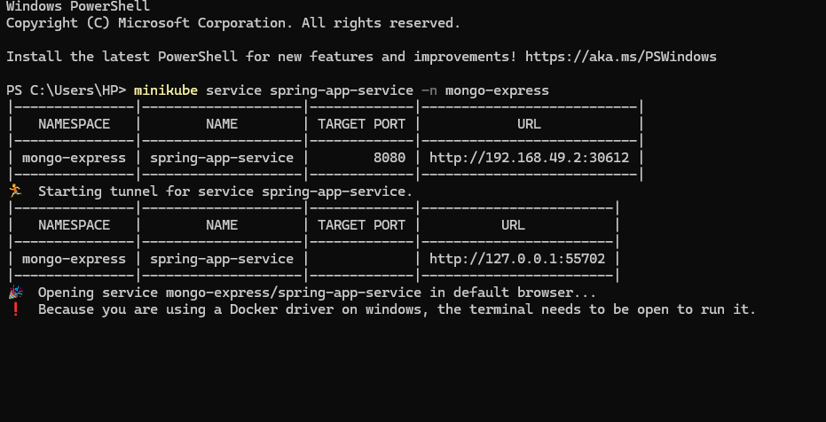
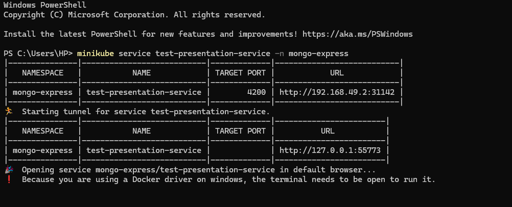
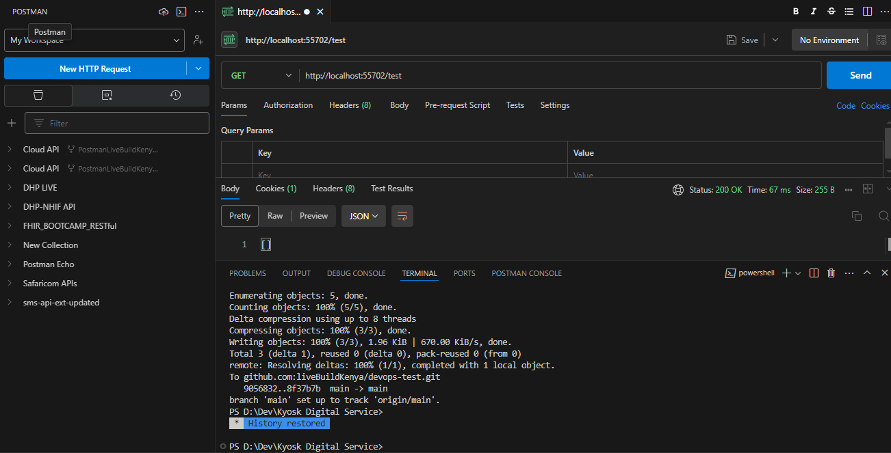
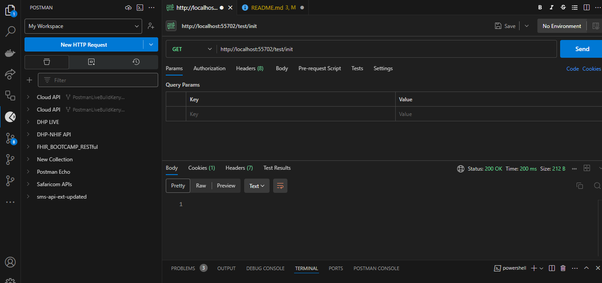
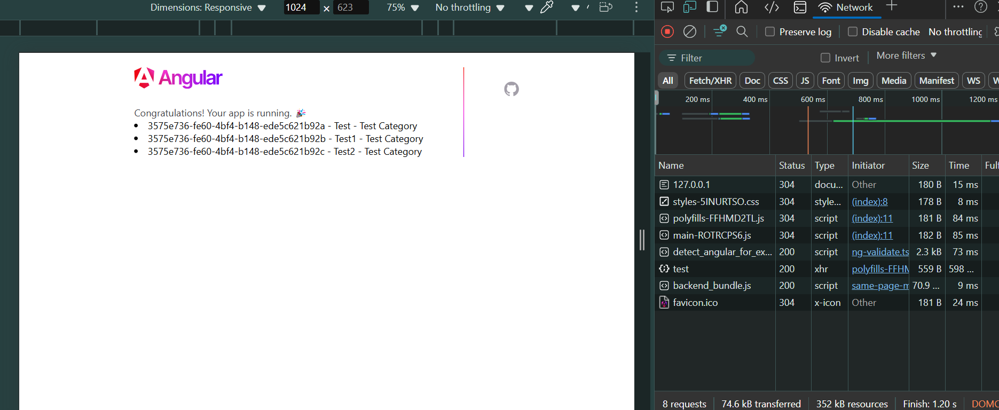

# DevOps Test

Behold a repository where GitHub workflows perform CI/CD magic tricks, Kubernetes yml files orchestrate container parades, and Docker Compose yml files masterfully herd multi-container cats. A sturdy Spring Boot backend teams up with an Angular frontend, both decked out in Docker build costumes. This code isn't just about fun and games — it's an expertly crafted spectacle of automation, scalability, and ingenuity, ensuring your deployment is nothing short of a professional performance.

## Prerequisites

Before you begin, make sure you have the following tools installed on your system:

- **Git**: [Install Git](https://git-scm.com/book/en/v2/Getting-Started-Installing-Git)
- **Docker**: [Install Docker](https://docs.docker.com/get-docker/)
- **Docker Compose**: [Install Docker Compose](https://docs.docker.com/compose/install/)
- **kubectl**: [Install kubectl](https://kubernetes.io/docs/tasks/tools/install-kubectl/)
- **Minikube**: [Install Minikube](https://minikube.sigs.k8s.io/docs/start/)

## Cloning the Repository

To clone the repository, follow these steps:

1. Open your terminal.
2. Navigate to the directory where you want to clone the repository.
3. Run the following command:

    ```bash
    git clone https://github.com/liveBuildKenya/devops-test
    ```

4. Navigate to the cloned repository:

    ```sh
    cd devops-test
    ```

## 1. Build and Run Locally with Docker

- Ensure Docker is installed and running.
- Use the provided `docker-compose.yml` to build and run the application and its related infrastructure locally:
  - Mongodb - Database
  - Mongo-express - Administrative web user interface for mongodb
  - Java 17 Spring Boot applications in MVC and,
  - An Angular 19 web application.
- Change directory to the docker compose file:
  
  ```bash
  cd ./infrastructure
  ```

- Copy the `.env.example` file to `.env`:
  
  ```bash
  cp .env.example .env
  ```

- Run the following command:
  
  ```bash
  docker-compose up -d --build
  ```

- Confirm if running:
  
  ```bash
  docker ps
  ```

## 2. Deploy on Minikube

### Required Minikube Setup

1. Install [kubectl](https://kubernetes.io/docs/tasks/tools/install-kubectl/) and [Minikube](https://minikube.sigs.k8s.io/docs/start/).
2. Start Minikube:

   ```bash
   minikube start
   ```

3. Set up kubectl context:
  
   ```bash
   kubectl config use-context minikube
   ```

### How to Access the Application

- Deploy the application using the provided Kubernetes YAML files:
  - Deploy mongodb with mongo express:

    ```bash
    kubectl apply -f ./infrastructure/mongodb.yml
    ```
  
  - Access Mongo Express url:
  
    ```bash
    minikube service mongo-express-service -n mongo-express
    ```

  - Deploy Java spring boot application:

    ```bash
    kubectl apply -f ./infrastructure/spring.yml
    ```

  - Access Java Spring API url:
  
    ```bash
    minikube service spring-app-service -n mongo-express
    ```

  - In the `./infrastructure/kube/presentation.yml` file update the env section of `test-presentation` deployment to point the port provisioned for the `spring-app-service`.
  - Update your dns settings or host file to include `spring-app-service.mongo-express` pointing to `127.0.0.1`.
  - Deploy web UI:

    ```bash
    kubectl apply -f ./infrastructure/presentation.yml
    ```

- Access the applications via Minikube's IP:
  
  ```bash
  minikube service test-presentation-service -n mongo-express
  ```

## 3. CI/CD Pipeline with GitHub Actions

- The repository includes a GitHub Actions workflow configuration file (`.github/workflows/<file-name>.yml`).
- The pipeline automates testing, building, and deploying both applications.
  - Steps typically include:
    - Checkout code.
    - Set up Docker environment.
    - Build Docker images for the Angular and Spring Boot apps.
    - Login to the docker container registry.
    - Push images to a container registry.

## 4. Assumptions, Decisions, and Challenges

- Challenge: Ensuring network communication between the Angular frontend and Spring Boot backend versions.


## Screenshots









### Contact Information

Name: **Ezra Mungai**

Phone: **+254790801990**

LinkedIn: [Mungai, Ezra](https://www.linkedin.com/in/ezra-mungai-494892a4/)

Email: mungaiezrakaruoya@live.com
